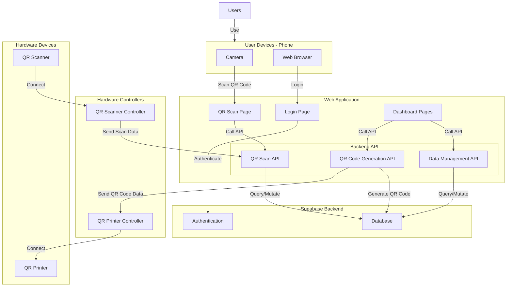

# High Level Overview

This document provides a high-level overview of the architecture, components, and pages of the project. 

## Table of Contents

- [High Level Overview](#high-level-overview)
  - [Table of Contents](#table-of-contents)
  - [Architecture Diagram](#architecture-diagram)
    - [Explanation of Components](#explanation-of-components)
      - [Users](#users)
      - [User Devices](#user-devices)
      - [Web Application](#web-application)
      - [Backend API](#backend-api)
      - [Supabase Backend](#supabase-backend)
      - [Hardware Controllers](#hardware-controllers)
      - [Hardware Devices](#hardware-devices)
  - [Pages](#pages)
    - [Admin Pusat (Central Admin) Pages](#admin-pusat-central-admin-pages)
    - [Admin Node (Node Admin) Pages](#admin-node-node-admin-pages)
    - [Petugas (Operator) Pages](#petugas-operator-pages)
    - [General Page](#general-page)

## Architecture Diagram

### Explanation of Components

#### Users

- Represents the end-users who interact with the system.

#### User Devices

- Camera: Used to scan QR codes.
- Browser: Provides access to the web application.

#### Web Application

- Login Page: Allows users to authenticate and access the system.
- QR Scan Page: Enables users to scan QR codes.
- Dashboard Pages: Manage and view various data
  - User Management
  - Inventory Management
  - Node Management
  - Transit Management
  - Report Management
  - Recipe Management

#### Backend API

- QR Scan API: Handles requests related to scanning QR codes.
- QR Code Generation API: Manages the generation of QR codes.
- Data Management API: Handles data-related operations such as querying and mutating the database. Examples:
  - CRUD operations for users, inventory, nodes, transit, reports, and recipes.
  - Managing which node/user has access to which data.
  - Managing how a report is handled.

#### Supabase Backend

- Authentication: Manages user authentication and authorization.
- Database: Stores all the data for the application.

#### Hardware Controllers

- QR Scanner Controller: Interfaces with the QR scanner hardware to send scanned data to the backend.
- QR Printer Controller: Interfaces with the QR printer hardware to print generated QR codes.

#### Hardware Devices

- QR Scanner: A physical device used to scan QR codes.
- QR Printer: A physical device used to print QR codes.

## Pages

### Admin Pusat (Central Admin) Pages

* **Admin Dashboard:** Provides a high-level overview of inventory, reports, and distribution status across all nodes.
* **Admin Node Management:** Allows for the creation, editing, and deletion of all nodes in the system.
* **Admin User Management:** Manages all user accounts across all nodes, including assigning roles and permissions.
* **Admin Inventory Management:** Offers a global view and management of inventory data from every node.
* **Admin Item Management:** Manages the master list of all item types available throughout the system.
* **Admin Report Management:** Displays and manages all discrepancy reports submitted from any node.
* **Admin Distribution Management:** Tracks and manages all item transit records between different nodes.
* **Admin Menu Management:** Manages all recipe/menu data across all nodes, including approving temporary menus.
* **Admin QR Code Management:** Provides centralized management for generating, viewing, and deleting all QR codes in the system.

### Admin Node (Node Admin) Pages

* **Node Dashboard:** Shows a summary of key data like inventory and reports specific to that admin's node.
* **Node User Management:** Manages user accounts and roles exclusively for the admin's own node.
* **Node Inventory Management:** Allows for detailed management of inventory items within that specific node.
* **Node Report Management:** Views and manages discrepancy reports submitted from within the admin's node.
* **Node QR Code Page:** Handles the creation and management of QR codes used for tracking items.
* **Item Management Page (Source Node Only):** Allows a Source Node Admin to create and manage new types of items for the system.
* **Menu Page (Assembly Node Only):** Enables an Assembly Node Admin to create, manage, and approve recipes for their kitchen.

### Petugas (Operator) Pages

* **QR Scanner Page:** The primary tool for operators to scan QR codes on items during sending, receiving, or reporting issues.
* **Scan History Page:** Displays a log of all previous scanning activities for the currently logged-in operator.
* **Operator Report Page:** Allows operators to view the status of discrepancy reports they have submitted.
* **Cooking Page (Assembly Node Only):** Lets a Kitchen Operator select a menu item and record how many portions are being cooked, which updates inventory.

### General Page

* **Login Page:** The entry point for all users to authenticate and access the system with their credentials.